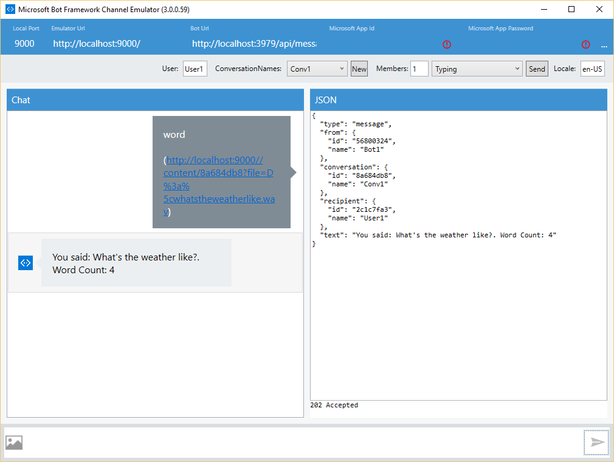

# Speech To Text Bot Sample

A sample bot that illustrates how to use the Microsoft Cognitive Services Bing Speech API to analyze an audio file and convert the audio stream to text.

[](https://azuredeploy.net)

### Prerequisites

The minimum prerequisites to run this sample are:
* The latest update of Visual Studio 2015. You can download the community version [here](http://www.visualstudio.com) for free.
* The Bot Framework Emulator. To install the Bot Framework Emulator, download it from [here](https://aka.ms/bf-bc-emulator). Please refer to [this documentation article](https://docs.botframework.com/en-us/csharp/builder/sdkreference/gettingstarted.html#emulator) to know more about the Bot Framework Emulator.
* **[Recommended]** Visual Studio Code for IntelliSense and debugging, download it from [here](https://code.visualstudio.com/) for free.
* This sample currently uses a free trial Microsoft Cognitive service key with limited QPS. Please subscribe to Bing Speech Api services [here](https://www.microsoft.com/cognitive-services/en-us/subscriptions) and update the `MicrosoftSpeechApiKey` key in key in [Web.config](Web.config) file to try it out further.

### Usage

Attach an audio file (wav format) and send an optional command as text. 
Supported Commands:
* `WORD` - Counts the number of words.
* `CHARACTER` - Counts the number of characters excluding spaces.
* `SPACE` - Counts the number of spaces.
* `VOWEL` - Counts the number of vowels.
* Any other word will count the occurrences of that word in the transcribed text

### Code Highlights

Microsoft Cognitive Services provides a Speech Recognition API to convert audio into text. Check out [Bing Speech API](https://www.microsoft.com/cognitive-services/en-us/speech-api) for a complete reference of Speech APIs available. In this sample we are using the Speech Recognition API using the [REST API](https://www.microsoft.com/cognitive-services/en-us/Speech-api/documentation/API-Reference-REST/BingVoiceRecognition).

In this sample we are using the API to get the text and send it back to the user. Check out the use of the `MicrosoftCognitiveSpeechService.GetTextFromAudioAsync()` method in the [Controllers/MessagesController](Controllers/MessagesController.cs) class.
````C#
var audioAttachment = activity.Attachments?.FirstOrDefault(a => a.ContentType.Equals("audio/wav"));
if (audioAttachment != null)
{
    using (var client = new HttpClient())
    {
        var stream = await client.GetStreamAsync(audioAttachment.ContentUrl);
        var text = await this.speechService.GetTextFromAudioAsync(stream);
        message = ProcessText(activity.Text, text);
    }
}
````

and here is the implementation of `MicrosoftCognitiveSpeechService.GetTextFromAudioAsync()` in [Services/MicrosoftCognitiveSpeechService.cs](Services/MicrosoftCognitiveSpeechService.cs)
````C#
/// <summary>
/// Gets text from an audio stream.
/// </summary>
/// <param name="audiostream"></param>
/// <returns>Transcribed text. </returns>
public async Task<string> GetTextFromAudioAsync(Stream audiostream)
{
    var requestUri = @"https://speech.platform.bing.com/recognize?scenarios=smd&appid=D4D52672-91D7-4C74-8AD8-42B1D98141A5&locale=en-US&device.os=bot&version=3.0&format=json&instanceid=565D69FF-E928-4B7E-87DA-9A750B96D9E3&requestid=" + Guid.NewGuid();

    using (var client = new HttpClient())
    {
        var token = Authentication.Instance.GetAccessToken();
        client.DefaultRequestHeaders.Add("Authorization", "Bearer " + token.access_token);

        using (var binaryContent = new ByteArrayContent(StreamToBytes(audiostream)))
        {
            binaryContent.Headers.TryAddWithoutValidation("content-type", "audio/wav; codec=\"audio/pcm\"; samplerate=16000");

            var response = await client.PostAsync(requestUri, binaryContent);
            var responseString = await response.Content.ReadAsStringAsync();
            dynamic data = JsonConvert.DeserializeObject(responseString);
            return data.header.name;
        }
    }
}
````

### Outcome

You will see the following when connecting the Bot to the Emulator and send it an audio file and a command:

Input:

["What's the weather like?"](audio/whatstheweatherlike.wav)

Output:



### More Information

To get more information about how to get started in Bot Builder for .NET and Microsoft Cognitive Services Bing Speech API please review the following resources:
* [Bot Builder for .NET](https://docs.botframework.com/en-us/csharp/builder/sdkreference/index.html)
* [Microsoft Cognitive Services Bing Speech API](https://www.microsoft.com/cognitive-services/en-us/speech-api)
